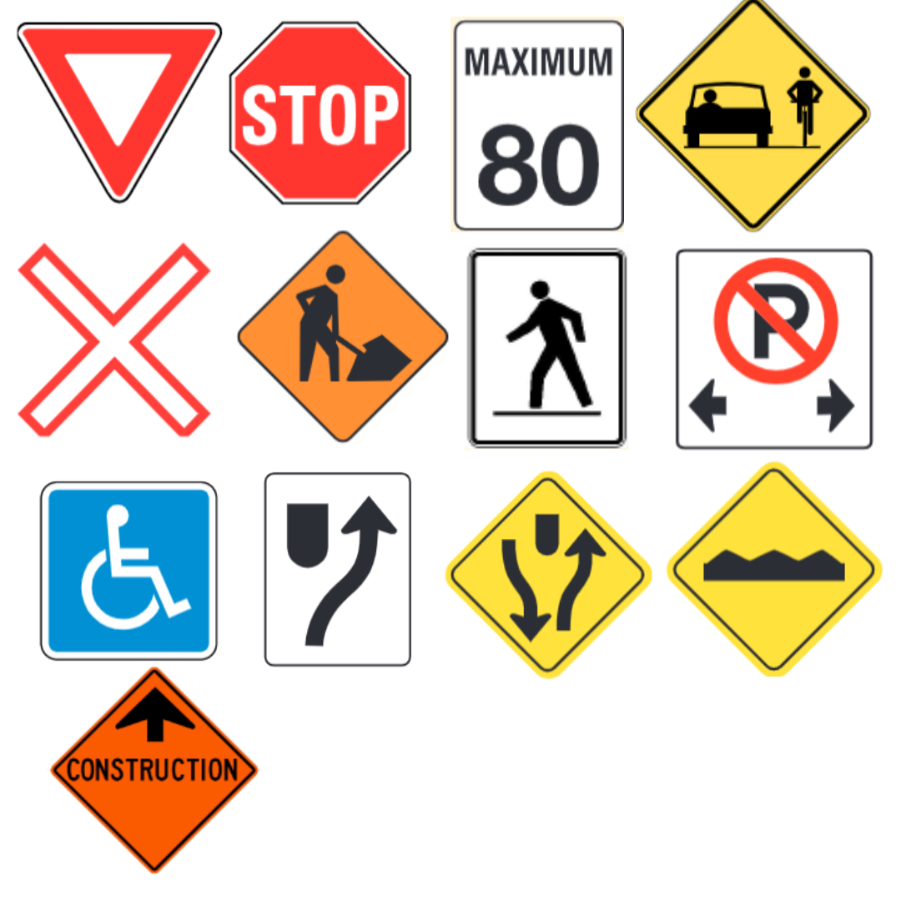
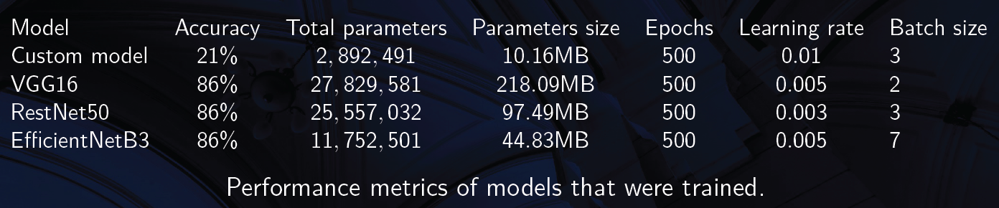
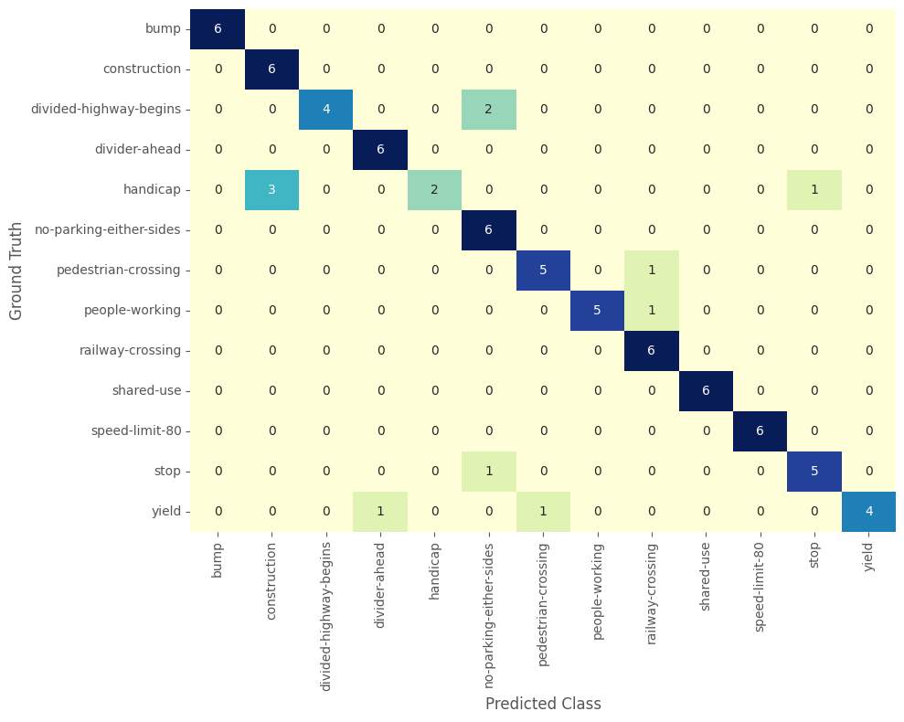

# Vision based model for classification of traffic road signs in Alberta province
This is my capstone project at Lighthouse Labs (Canada's leading coding bootcamp). I decided to work on this project because of the following reasons:

1. After rambling around different thoughts for around one week, this was the first project idea that I could fully conceptualize completing within the 12 days deadline (including Saturdays and Sundays).
2. I wanted to learn a different skillset we haven't been taught during the bootcamp.
3. It was difficult to understand all of the road signs after I first relocated to Canada earlier this year.
4. The problem is unique as there is no dataset readily available to train the neural network model. A unique twist had to be applied.

## Project goals

The goal of this project is to train a pretrained CNN model to classify road signs for Alberta province. The dataset for this unique problem is not readily available, so the one-shot learning technique was used to train models on a training dataset of 13 images (one for each class) and validation dataset of 78 images (6 for each class). Six random images were also selected for testing (images the model hasn't seen before). The total dataset has 175 images (along with generated data augmentation training images). This project is also an end-to-end project as it was deployed as a web app through the `Streamlit` library. You can assess the deployed web app [here](https://roadsignsdetection.streamlit.app/)

The categories of road signs that were used in this project are:
1. bump
2. construction
3. divided-highway-begins
4. divider-ahead
5. handicap
6. no-parking-either-sides
7. pedestrian-crossing
8. people-working
9. railway-crossing
10. shared-use
11. speed-limit-80
12. stop
13. yield

A catalogue of thier pictures is also shown below:

## Processing

Data augmentations were used to augment the lack of sufficient data for training the models through transfer learning. Due to the small dataset, using a custom model would not be able to identify the road signs (because of low accuracy). Out of curiosity, I decided to train different models on the dataset and compare their performance. The architectures used for training were EfficientNetB3, RestNet50, VGG16 and a custom RNN model.

#### The modelling process 

   The following are some of the customized setup for the architectures:

   - **Batch size:** Different batch sizes were used while training the different models and distinct values were used depending on the architecture.

   - **Learning rate:** Value used to train model varied across architectures.

   - **Number of epochs:** 500 was sufficient for training the models as there was no improvements beyond that number of iterations.

   - **Adam and SVD optimizers:** Adam's optimizer was used for the EfficentNetB3 and VGG16 models, excluding the RestNet50 architecture which had higher accuracy with the SVD optimizer.

   - **ReduceLROnPlateau:** This reduces the learning rate when a metric has stopped improving.

   The final layers of the architectures were fine-tuned by using three Linear layers, two ReLU layers and a SoftMax function for the multi-class output. These were the fine-tuning used for the EfficentNetB3 model. The following figure summarizes the performance metrics along with some hyperparameters used to obtain the final results.

   
    
    From the figures, all three pretrained models have an accuracy of 86% but the RestNet50 and VGG16 models are more older models and heavier than the EfficientNetB3 model. During one of the model training sessions, I actually achieved an accuracy of 95% with the RestNet50 model but I made a mistake of using 10 classes in the output features of the final layer instead of 13. This costly mistake means I had to discard that trained model and continue to retrain. The highest accuracy I achieved with the EfficientNetB3 model was 88% (while I was training with 10 classes).

## Results

The highest accuracy that was obtained during the time frame of this project is 86%. The EfficientNetB3 model was preferred because it is lightweight compared to the other models and can be easily deployed to a mobile application. The preferred trained model was saved to the output folder in the repo as a `.pth` file. 

> The trained model currently has an accuracy of 87%. Running the `train_new_model=True` code line in the `main.ipynb` file will delete the saved model and retrain a new model. To avoid this, you can set this to false, i.e., `train_new_model=False`. If you would prefer training your own model using more efficient hyperparameter combinations, then you can leave the code line as it is.

- This is an example of the model's prediction on a random image

- A demo of the deployed model on a [web app](https://roadsignsdetection.streamlit.app/) using Streamlit library is presented below:

<video width="640" height="300" controls>
  <source src="figures/streamlit-demo.mov" type="video/mp4">
</video>

This is the confusion matrix for the preferred architecture

The confusion matrix gives a preview to the model's performance when deployed. The model can accurately classify the bump, construction, divider-ahead, no-parking-either-sides, railway-crossing, shared-use and speed-limit-80 road signs. The model will misclassify pedestrian-crossing, people-working and stop signs 17% of the time. The model will incorrectly classify divided-highway-begins and yield signs 34% of the time. Finally, it will misclassify handicap 34% of the time.

## Tech stack

* `PyTorch` library
* `EfficientNetB3` pretrained model from the `TorchVision` module
* `RestNet50` pretrained model from the `TorchVision` module
* `VGG16` pretrained model from the `TorchVision` module
* `Streamlit` library for deploying the model
* `Scikit-Learn` library for model evaluation and performance review
* `Matplotlib` library for visualizations

## Repo breakdown

This is a quick guide to understanding the schematics of this repository:

* `data` : contains the train, validate and test folders for the model training and testing process. This folder contains three folders. 
    - The `train` folder contains 13 folders for each class and each folder has one image. 
    - The `test` folder also contains 13 folders for each class and each folder contains 6 images (for validation). 
    - The `test_set` folder contains only 6 random class images for testing the model's predicted classes.
* `figures` : contains the figures used in the deployed website app. It also contains the figures and video used in this file.
* `output` : contains the saved trained model and has a subfolder.
    - The `figures` folder contains all the figures generated through the entire modelling process.
* `src` : contains the `main.ipynb` file for training the model and other subsequent folders for the python scripts.
    - The `modules` folder contains the `data_preprocessing.py` file for data preprocessing, the `figure_generation.py` file for the figures to be generated. The `model_results.py` file generates the number of correct predictions, total images in the dataset, test accuracy, test loss, y and y_pred to be used for further performance metrics. The `model_training.py` file is the script containing the model training code.
    - The `tests` folder contains the `model_testing.py` file which is used to generate annotated predictions on random test images.
* `app.py`  : The deployed app built using Streamlit library. To run the deployed model, simply use 

        streamlit run app.py

in the command line, from the folder directory containing this python script.
* `utils.py`  : Contains helper fuctions required in the `app.py`

## Challenges 
 - Training the model and understanding the model's outputs were initially a challenge.
 - Manually tweaking the hyperparameters was quite difficult and time consuming.
 - Getting a high accuracy required lots and lots of different trainings and hyperparameter tuning. I tried using `Ray Tune` to automate the hyperparameter tuning but got the highest accuracy I got was 22%.
 - Due to time constraints, the model is only being deployed on a local host computer.

## Future Goals
- Increase the classes of road signs to include more categories.
- Learn how to properly use the `Ray Tune` library to obtain optimal hyperparameters for higher accuracy.
- Build a mobile app with the model such that, people can take pictures and get the name of the road sign on-the-go.
- Permanently deploy the model on AWS cloud platform.

>###### *Questions or thoughts: **Please reach out to me through my e-mail** drsamuelsurulere@gmail.com* Any ideas for improvements on this project will be highly welcomed.
